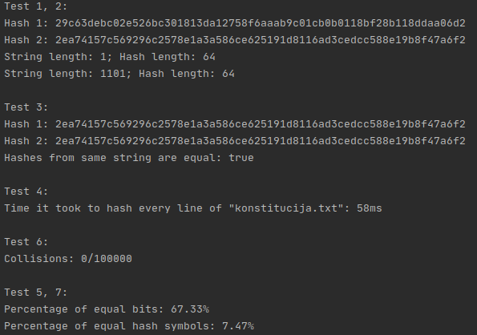

# vu-hash-function

## Hash generatorius

#### Bet kokio ilgio _string_ tipo duomenis paverčia į 64 bitų šešioliktainį kodą.

#### VU ISI Blokų grandinų techonologijų atsiskaitymo darbas

### Testai

