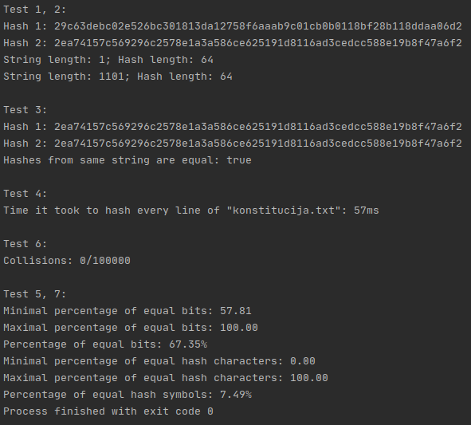

# vu-hash-function

## Hash generatorius

#### Bet kokio ilgio _string_ tipo duomenis paverčia į 64 bitų šešioliktainį kodą.

#### VU ISI Blokų grandinų techonologijų atsiskaitymo darbas

### Hash funkcijos reikalavimai:
1. Maišos funkcijos įėjimas (angl. input) gali būti bet kokio dydžio simbolių eilutė (angl. string).

2. Maišos funkcijos išėjimas (angl. output) visuomet yra to paties
fiksuoto, dydžio rezultatas (pageidautina 256 bit'ų ilgio, t.y., 64 simbolių hex'as).

3. Maišos funkcija yra deterministinė, t. y., tam pačiam įvedimui (input'ui) išvedimas (output'as) visuomet yra tas pats.

4. Maišos funkcijos reikšmė/kodas (hash‘as) bet kokiai input'o reikšmei yra apskaičiuojamas greitai - efektyviai.

5. Iš hash funkcijos rezultato (output'o) praktiškai neįmanoma atgaminti pradinio įvedimo (input'o).

6. Maišos funkcija yra atspari "kolizijai" (angl. collision resistance), t.y., praktiškai neįmanoma surasti tokių dviejų skirtingų argumentų, kad jiems gautume tą patį hash'ą:

7. Bent minimaliai pakeitus įvedimą, pvz.vietoj "Lietuva" pateikus "lietuva", maišos funkcijos rezultatas-kodas turi skirtis iš esmės, t.y., tenkinamas taip vadinamas lavinos efektas (angl. Avalanche effect). Žemiau esančioje lentelėje iliustruota tai naudojant SHA256:

### Pseudokodas
```
function getHash()
    pass in string to be 'hashed'
    initialize integer as 'hashInt'
    
    FOR EACH character in string as 'elem'
        hashInt <- hashInt in power of 3
        hashInt <- complemented elem % complemented hashInt
        hashInt <- shift bits of hashInt to the left by complemented hashInt hashInt <- shift bits of hashInt to the left by 1 
    ENDFOR
    
    Initialize StringBuilder with value of hashInt converted to hexadecimal string as 'hashBuilder'
    
    WHILE length of hashBuilder != 64
        FOR EACH character with type of integer in hashBuilder converted to char array as 'hashElem'
            hashInt <- hashInt in power of 3
            hashInt <- complemented hashElem % complemented hashInt
            hashInt <- shift bits of hashInt to the left by complemented hashInt hashInt <- shift bits of hashInt to the left by 1 
            hashBuilder <- hashInt converted to hexadecimal string
        ENDFOR
        
        int hashLength = hashBuilder.length();
        IF length of hashBuilder > 64
            subtract hashBuilder to length of 64
        ENDIF
    ENDWHILE
    
    pass out hashBuilder converted to string

```

### Testai

#### Testavimo atvejai

1. Susikurkite testinių įvedimo failų pavyzdžių, tokių kad:
Bent du failai būtų sudaryti tik iš vieno, tačiau skirtingo, simbolio.
Bent du failai būtų sudaryti iš daug (> 1000) atsitiktinai sugeneruotų simbolių.
Bent du failai būtų sudaryti iš daug (> 1000) simbolių, bet skirtųsi vienas nuo kito tik vienu (pvz. vidurinėje pozicijoje esančiu)
simboliu.
Tuščio failo.
2. Naudojant šiuos failus, kaip Jūsų programos input'us, įsitikinkite, kad Jūsų hash funkcija atitinka 1-3-ą reikalavimus, t.y., nepriklausomai
nuo Input'o, Output'ai visada yra vienodo dydžio, o to paties failo hash'as yra tas pats.
3. Ištirkite Jūsų sukurtos hash funkcijos efektyvumą: tuo tikslu suhash'uokite kiekvieną eilutę iš konstitucija.txt failo ir išmatuokite kiek
laiko visa tai užtruko. Reiktų matuoti, tik hash'avimo funkcijos veikimo laiką (be input'o nuskaitymo/parengimo). Reiktų pateikti bendrą
suminį visų hash'avimų laiką.
Papildoma užduotis - norintiems užsidirbti extra balų (iki 0.5). Pabandykite kaip įmanoma objektyviau palyginti Jūsų Hash
funkcijos spartą su MD5, SHA-1, SHA-256 ar kita gerai žinoma hash funkcija. Paliekame Jums sugalvoti, kaip atlikti tokį
palyginima kaip įmanoma objektyviau.
4. Susigeneruokite bent 100 000 atsitiktinių simbolių eilučių ( string'ų) porų, pvz. (asdfg, hijkl), apsiribojant iki 1000 simbolių ilgi). Toje
pačioje poroje esančių string'ų ilgiai turi sutapti, tačiau skirtingos poros gali būti skirtingo ilgio. Rekomenduojame susigeneruoti taip:
25 000 porų, kurių ilgis 10 simbolių, kitas 25 000 porų, kurių ilgis - 100, dar kitas 25 000 poras - 500, ir galiausiai likusias 25 000
poras, kurių ilgis - 1000.
5. Tuomet naudodami šias sugeneruotas poras, patikrinkite, ar tikrai visais atvejais gautieji porų hash'ai nesutampa. O jeigu sutampta, tai
kaip dažnai tai nutinka ir galbūt pabandykite ištaisyti programos realizaciją, kad to išvengti. Tokiu būdu (jeigu tikrai visuomet hash'ai
nesutampa) bent dalinai įsitikinsite, kad Jūsų hash funkcija atitinka 6-ą reikalavimą.
6. Susigeneruokite bent 100 000 atsitiktinių simbolių eilučių ( string'ų) porų, apsiribojant iki 1000 simbolių eilučių ilgiu (kaip ir
aukščiau) ir kad jos skirtųsi tik vienu simboliu pvz.: (asdfg, bsdfg). Įvertinkite Jūsų gautų hash'ų procentinį "skirtingumą":
bitų lygmenyje;
hex'ų lygmenyje.
Išveskite minimalią, maksimalią ir vidurkines "skirtingumo" reikšmes. Tokiu būdu įsitikinsite, kaip gerai Jūsų hash funkcija
atitinka 7-ą reikalavimą.

#### Testavimo rezultatai:



### Išvados

Hash algoritmas atitinka reikalavimus

#### Pranašumai:

Maža kolizijos tikimybė

#### Trūkumai:
Algoritmas nėra optimalaus greičio.
